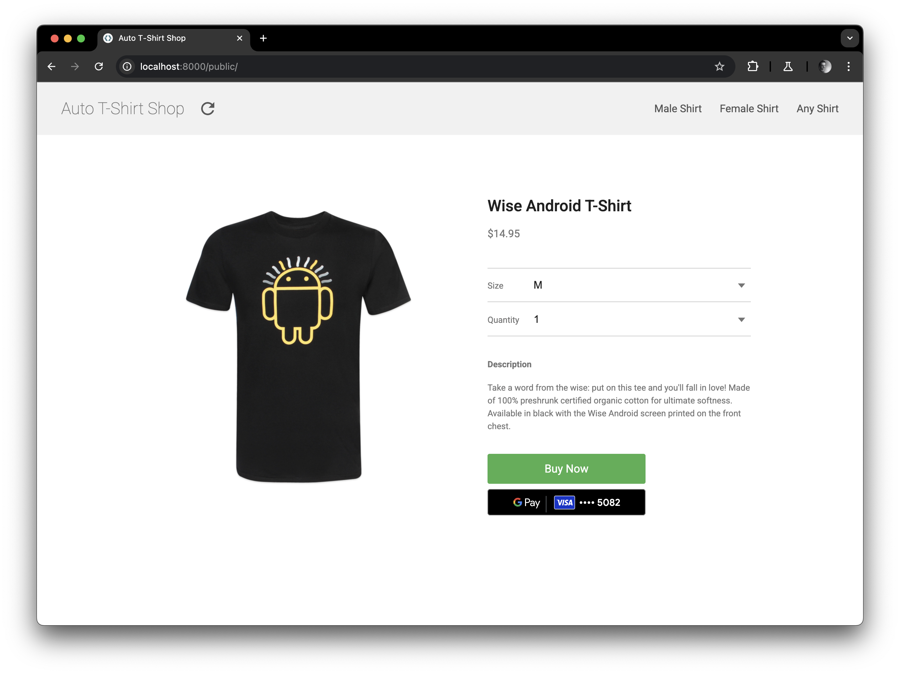

# Google Pay Web Checkout Playground

<!--- Open in IDX button -->
<a href="https://idx.google.com/new?template=https%3A%2F%2Fgithub.com%2Fgoogle-pay%2Fonline-quickstart-web%2Ftree%2Fmaster%2F">
  <picture>
    <source
      media="(prefers-color-scheme: dark)"
      srcset="https://cdn.idx.dev/btn/open_dark_32.svg">
    <source
      media="(prefers-color-scheme: light)"
      srcset="https://cdn.idx.dev/btn/open_light_32.svg">
    
  </picture>
</a>

Use this playground environment to experiment integrating Google Pay, as if you were working directly from your own checkout page.

    

Google Pay is loaded from your `index.html` file, and once completed, the function `onGooglePayLoaded` in the `index.js` file is called. This is your stating point to integrate Google Pay in this playground.

If you are interested to find out more, go check out a basic [guided tutorial](https://developers.google.com/pay/api/web/guides/tutorial) on how to integrate Google Pay API on the web, the [library reference](https://developers.google.com/pay/api/web/reference/object) and the [list of participating processors](https://developers.google.com/pay/api/web/#participating-google-pay-processors).